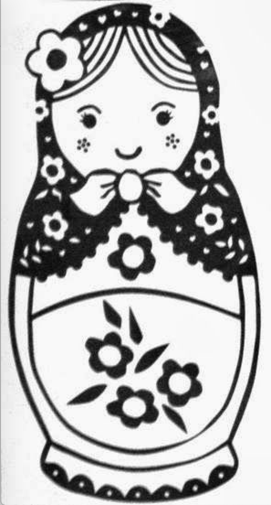

# Notes

## Challenge: Matryoshka doll

A photo is given. It was not opening with my image viewer. Using file command it was found that it is a png file. So renamed the file with a .png extension. After that it opened with the image viewer.

### The Image:



Running strings on the dolls.png reveals some information.At the end of the strings output of the file shows some other file name base_images/2_c.jpg.

```
6bgy
F}`|
N.]3
R^OY
.?7O
M:Yt
'bKW
LxoA
IKjk
{s(3
`,dO
1o'8+y
base_images/2_c.jpgUT
O`ux
```

But using xxd on the file to see the hexdump reveals some different folder name with the same jpg file name.

```bash
xxd dolls.png | grep jpg
```

Output:

```
00042890: 6d61 6765 732f 325f 632e 6a70 6755 5409  mages/2_c.jpgUT.
0009f140: 2e6a 7067 5554 0500 0368 fa4f 6075 780b  .jpgUT...h.O`ux.
```

Using the tool binwalk it was found that the file is a jpg file.The file can be extracted using binwalk.

```bash
binwalk -e dolls.png
```

After extracting the file 2_c.jpg file can be found. Again running binwalk on the 2_c.jpg file shows extracts another file named 3_c.jpg.Next 4_c.jpg is found from running binwalk on 3_c.jpg.
Finally, running binwalk on 4_c.jpg reveals flag.txt file which contains the flag.

The Flag:

```
picoCTF{e3f378fe6c1ea7f6bc5ac2c3d6801c1f}
```

References:

[1] https://afnom.net/wtctf/2019/magic/
