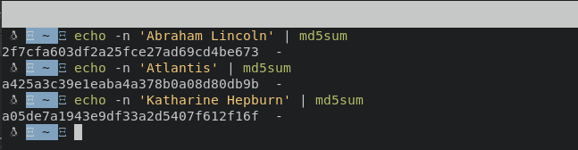

# Notes
## Challenge: HashingJobApp 

Given Url and port
```
nc saturn.picoctf.net 54555
```
Running nc on it.
### Command:
```bash
nc saturn.picoctf.net 54555
```
### Output:
```bash
Please md5 hash the text between quotes, excluding the quotes: 'a sunset'
Answer:
```
Multiple strings were given to submit the md5 hash of the strings.**md5sum** was used to submit the md5 hash of the strings.

### Command:
```bash
echo -n 'Abraham Lincoln' | md5sum
```
### Output:
```bash
2f7cfa603df2a25fce27ad69cd4be673  -
```
### All the md5 hashes:
.


### Output
```bash
Please md5 hash the text between quotes, excluding the quotes: 'Abraham Lincoln'
Answer:
2f7cfa603df2a25fce27ad69cd4be673
2f7cfa603df2a25fce27ad69cd4be673
Correct.
Please md5 hash the text between quotes, excluding the quotes: 'Atlantis'
Answer:
a425a3c39e1eaba4a378b0a08d80db9b
a425a3c39e1eaba4a378b0a08d80db9b
Correct.
Please md5 hash the text between quotes, excluding the quotes: 'Katharine Hepburn'
Answer:
a05de7a1943e9df33a2d5407f612f16f
a05de7a1943e9df33a2d5407f612f16f
Correct.
picoCTF{4ppl1c4710n_r3c31v3d_674c1de2}
```
### The flag
```
picoCTF{4ppl1c4710n_r3c31v3d_674c1de2}
```