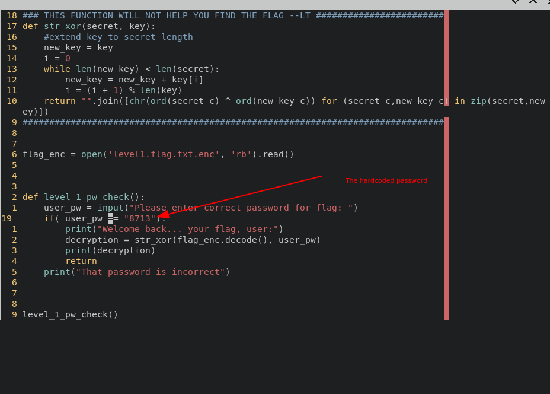

# Notes
## Challenge: PW Crack 1

Running the given level1.py file wants a password.Going through the python code shows that it checks with a hardcoded password with the user password.
Providing the hardcoded password gives the flag.
### Hardcoded password

### The flag
```
picoCTF{545h_r1ng1ng_1b2fd683}
```
