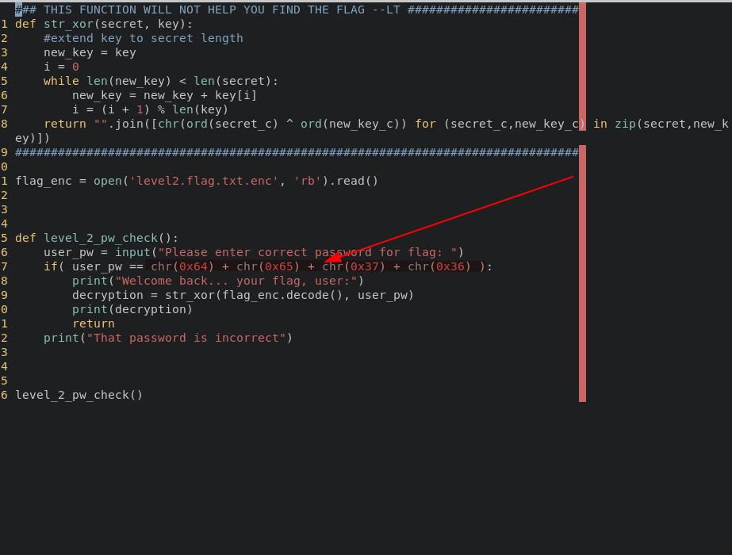

# Notes
## Challenge: PW Crack 2

Running the given level2.py file wants a password.Going through the python code shows that it checks with a hardcoded ASCII password with the user password.
Making a python script that converts the ASCII password to a string gives the password for the level2.py file. 

### Hardcoded ASCII password



### ASCII to String conversion script for the hardcoded password

```python
#!/usr/bin/env python3

password = chr(0x64) + chr(0x65) + chr(0x37) + chr(0x36)
print(password)
```
The get_pass.py file contains the same code.
Running the conversion script gives the password
### The password
```
de76
```
Running the level2.py file and giving the password gives the flag
### The flag
```
picoCTF{tr45h_51ng1ng_489dea9a}
```
`