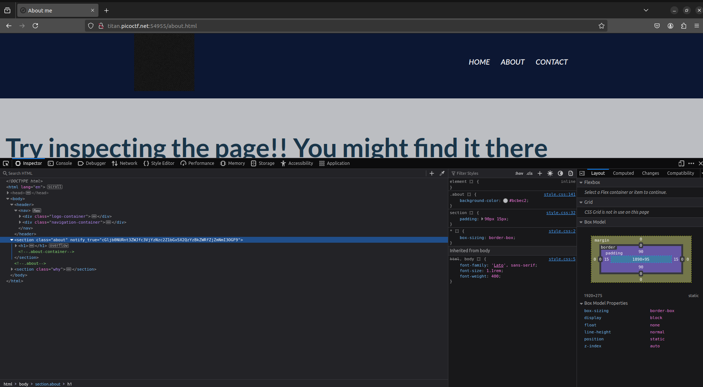

# Notes

## Challenge: `WebDecode`

### Given Website link:
http://titan.picoctf.net:62242/


I tried running strings on the images on the site. Did not get anything useful.

When going through the page source found this on the `About` page:


The base64 encoded string 

```
cGljb0NURnt3ZWJfc3VjYzNzc2Z1bGx5X2QzYzBkZWRfZjZmNmI3OGF9
```

Run this to decode the string:
```bash
echo "cGljb0NURnt3ZWJfc3VjYzNzc2Z1bGx5X2QzYzBkZWRfZjZmNmI3OGF9" | base64 --decode
```

This gives us the flag:
```
picoCTF{web_succ3ssfully_d3c0ded_f6f6b78a}
```


